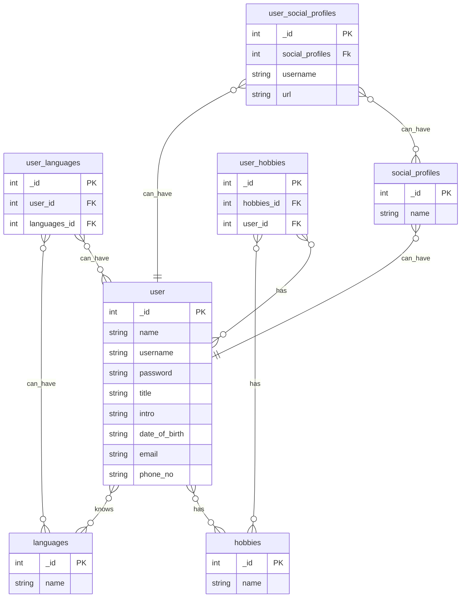

## **Backend technologies**
Node JS, ExpressJs, Typescript, PostgreSQL

---
## **Frontend technologies**
Next.js

---
## **Backend Commands**

 You must have postgres installed on your local


## run the migrations:

>```npx mikro-orm migration:create```< OR >```npm run create:migration```

>``` npx mikro-orm migration:up```< OR  > ```npm run up:migration```


## Make the build:

>```npm run build:watch```

## Run server:

>```npm run dev```

## Database Structure:
All of these tables has created_at and updated_at
